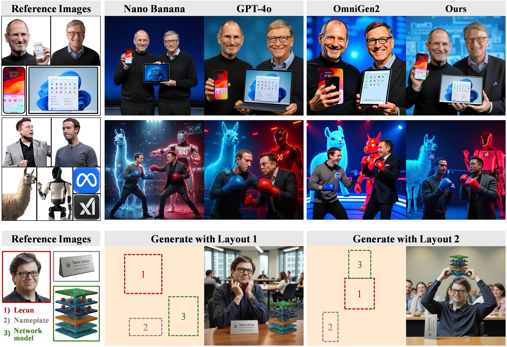
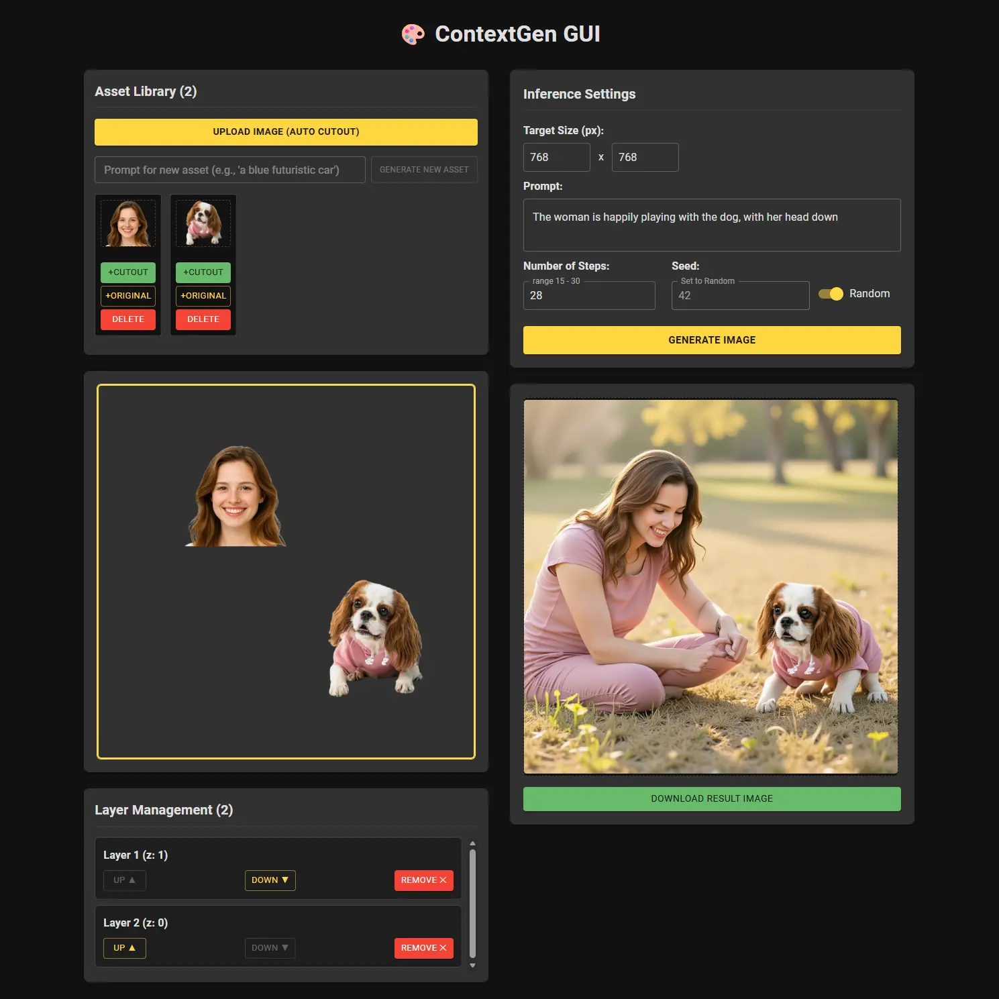

<h1 align="center">
ContextGen: Contextual Layout Anchoring </br> for Identity-Consistent Multi-Instance Generation
</h1>

<p align="center">
<a href="https://scholar.google.com/citations?user=5ZDU6wwAAAAJ">Ruihang Xu</a>,
<a href="https://scholar.google.com/citations?user=4C_OwWMAAAAJ">Dewei Zhou</a>,
<a href="https://scholar.google.com/citations?user=FyglsaAAAAAJ">Fan Ma</a>,
<a href="https://scholar.google.com/citations?user=RMSuNFwAAAAJ">Yi Yang</a><sup>&#8224;</sup> <br>
<span>ReLER, CCAI, Zhejiang University</span>
</p>

<p align="center">
<a href="https://nenhang.github.io/ContextGen"></a>
<a href="https://arxiv.org/abs/2510.11000"></a>
<a href="https://github.com/nenhang/IMIG-Source"></a>
<a href="https://huggingface.co/ruihangxu/ContextGen"></a>
</p>

## 🔥 Updates

- 2025.12.8: Released the inference code, training code, pretrained model weights, and GUI support for ContextGen.
- 2025.10.19: Released the [IMIG-Dataset construction pipeline](https://github.com/nenhang/IMIG-Source).

## 📝 Introduction



**ContextGen** is a novel framework that uses **user-provided reference images** to generate image with multiple instances, offering **layout control** over their positions while guaranteeing **identity preservation**.

## ✅ To-Do List

- [x] Arxiv Paper
- [x] Inference Code
- [x] Training Code
- [x] Dataset Generation Code
- [x] Huggingface Model Weights
- [x] GUI Support

## 🚀 Quick Start

### Environment Setup

```bash
conda create contextgen python=3.12 -y
conda activate contextgen
pip install -r requirements.txt
```

### Download Pretrained Models

Download [FLUX.1-Kontext](https://huggingface.co/black-forest-labs/FLUX.1-Kontext-dev) and [ContextGen Adapter](https://huggingface.co/ruihangxu/ContextGen). Configure the weight paths in a `.env` file and place it in the root directory. You can refer to the `.env_template` file. The format is as follows:

```bash
KONTEXT_MODEL_PATH="path_to_kontext_model"
ADAPTER_PATH="path_to_contextgen_adapter"
```

### Inference

> **⚠️ GPU Memory Note:** The inference process requires **~35-40GB GPU memory**. We're working on quantization and optimization to reduce the memory footprint in future releases.

To run inference on the provided demos, simply execute:

```bash
python inference.py
```

The generated results will be saved in the `images/output` folder.

- For Custom Input: You can add your own images in the `images/input` folder and modify the inference.py file accordingly.

- More Demos: More interesting demos and results can be found on our [Project Page](https://nenhang.github.io/ContextGen).

- Recommended Interaction: For easier interaction, we highly recommend using our **[GUI Support](#gui-support)**.

### Training

You can customize your own dataset by referencing the [IMIG-Dataset construction code](https://github.com/nenhang/IMIG-Source). Remember to add your WANDB API key in the `.env` file for experiment tracking:

```bash
WANDB_API_KEY="your_wandb_api_key"
```

Then configure the training parameters in `train/config/config.yaml` and run:

```bash
python src/model/train.py
```

### GUI Support

We provide a simple GUI built with [Vite](https://vite.dev) and [React](https://react.dev) for easier interaction.

#### 1\. Model Dependencies & Setup

The GUI requires additional models. Please download them and set their full paths in the `.env` file:

- **Image Cutout (Required):** Download the [BEN2](https://huggingface.co/PramaLLC/BEN2) model.

    ```bash
    BEN_CKPT_PATH="path_to_ben2_model"
    ```

- **Asset Generation from Text (Optional):** Download the [FLUX.1-dev](https://huggingface.co/black-forest-labs/FLUX.1-dev) model.

    ```bash
    FLUX_MODEL_PATH="path_to_flux_model"
    ```

> **⚠️ GPU Memory Note:** Using the optional asset generation feature consumes an additional **\~30GB GPU memory**. If your single GPU memory is limited, consider loading this model on a different GPU. If you do not require this feature, you can comment out the related code in `gui/backend/app.py`.

#### 2\. NodeJS Dependencies

If you don't have Node.js and `npm` installed, you can install them as follows:

```bash
# install nvm
curl -o- https://raw.githubusercontent.com/nvm-sh/nvm/v0.40.3/install.sh | bash
# restart your terminal to load nvm, then install Node.js
nvm install --lts
```

#### 3\. Launching the GUI

To build and run the demo, follow these steps:

1. **Start Frontend:** In the first terminal, run the following commands:

    ```bash
    cd gui/frontend
    npm install
    npm run dev
    ```

2. **Start Backend:** Open a second terminal and run the backend server:

    ```bash
    python gui/backend/app.py
    ```

#### Accessing the GUI

Once both the frontend and backend servers are successfully launched, if you are working on a remote server, port forwarding is required. Please ensure the frontend port (`127.0.0.1:5173`) and the backend port (`127.0.0.1:5000`) are **forwarded to the corresponding ports** on your local machine. You can then access the GUI via your local browser at `http://localhost:5173`. A screenshot of the GUI is shown below:



## 💡 Tips

- For better identity rendering and visual quality, we recommend using **a middle resolution (e.g., 768x768 or 512x512)**. This strikes a balance, as higher resolutions may compromise identity consistency, while lower resolutions can introduce artifacts.
- To enhance visual quality and contextual consistency, we recommend using **a richer prompt** that includes detailed, interactive relationships between the instances.
- If a generated case fails or exhibits poor quality, please try again with **a different random seed**.

<h3 align="center">🎉 Enjoy Using ContextGen! 🎉</h3>

## 📭 Citation

If you find ContextGen helpful to your research, please consider citing our paper:

```bibtex
@article{xu2025contextgencontextuallayoutanchoring,
      title={ContextGen: Contextual Layout Anchoring for Identity-Consistent Multi-Instance Generation},
      author={Ruihang Xu and Dewei Zhou and Fan Ma and Yi Yang},
      year={2025},
      eprint={2510.11000},
      archivePrefix={arXiv},
      primaryClass={cs.CV},
      url={https://arxiv.org/abs/2510.11000},
}
```
